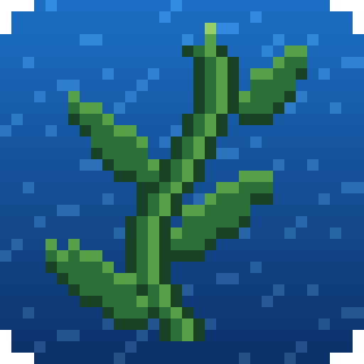

 > **NOT AN OFFICIAL MINECRAFT PRODUCT. NOT APPROVED BY OR ASSOCIATED WITH MOJANG OR MICROSOFT.**
  > Minecraft is a trademark of Microsoft Corporation.

# Kelp

A launcher for Minecraft: Java Edition, made from scratch, with an animated underwater look and the [Squid](https://github.com/KelpSquid/squid) mod loader built in.

## What it does

- **Instances:** separate setups, each with its own worlds, settings and mods
- **Any version:** every release and snapshot, from Mojang's official list
- **No setup:** Kelp downloads the game, and the right Java for each version, by itself
- **Squid:** turn it on for an instance to play with Squid mods, and see which ones loaded
- **Mods screen:** each mod's name, version and authors, with on/off switches, plus New Mod to make your own
- **Modpacks:** import Modrinth (.mrpack), CurseForge and Prism modpacks
- **Game options:** render distance, FOV, volume and more, changed from Kelp
- **World backups:** every 15 minutes while you play, like Legacy Console Edition, with one-click restore
- **Crash helper:** when the game crashes, Kelp says why in plain words and which mod caused it
- **Stats and Gallery:** play time, blocks mined, mobs defeated and more; your screenshots, clips and replay videos
- **Themes:** change Kelp's look (ocean, lava, sky, Nether, End), make your own with a picture and music, or get one
- **Emblems:** a Call of Duty style emblem next to your name, with better tools unlocked by your Squid Count
- **Badges:** Dev, Beta Tester, Early Player and more next to your name, handed out by Kelp's server
- **Parent Controls:** a PIN-locked switch for multiplayer and chat, using Minecraft's own switches
- **Delete Data:** removes everything Kelp keeps about a player from the computer
- **120 languages:** every language Minecraft has (all but English are BETA, not checked yet), drawn in Kelp's own
  pixel font, and upside-down English really is upside down
- **Auto-update:** Kelp updates itself from its GitHub releases

You need to own Minecraft: Java Edition to use Kelp.

## Running it

From source, with Java 21 or newer installed: run `run.bat`.

To make the downloads for Windows, Linux and Mac (each with its own Java), build [Squid](https://github.com/KelpSquid/squid) first, then run `package.bat`. They land in the `build` folder.

## Contact

Kelp is made by Samuel Arther, who is responsible for it. Mojang and Microsoft are not involved.
Questions or problems: [kelp@kelplauncher.org](mailto:kelp@kelplauncher.org).

Minecraft is a trademark of Microsoft Corporation.
